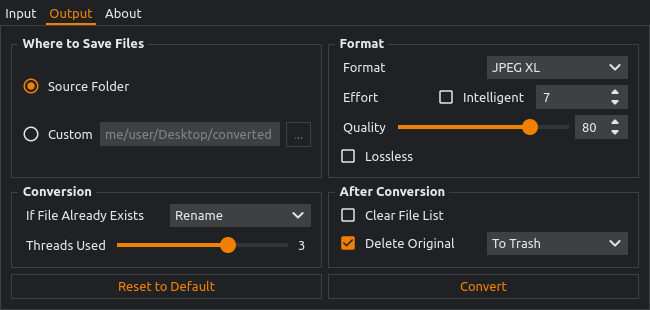
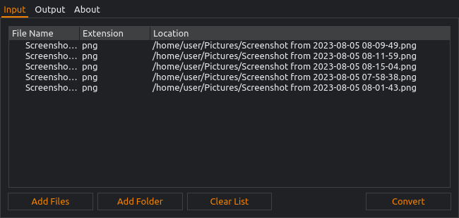
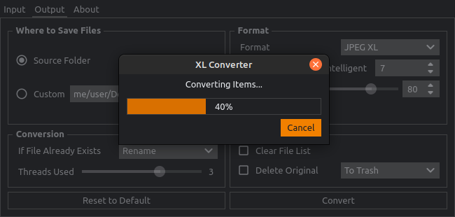
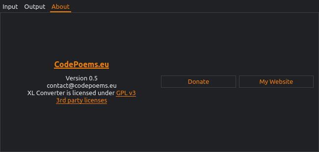

<p align="center">
    
</p>
<h3 align="center">XL Converter</h3>

Fast and simple image converter for the latest formats. It's fully multi-threaded, supports drag 'n drop and intelligent options.

Available for both Windows and Linux.





Supported formats:
- Encoding: JPEG XL, AVIF, WEBP, JPG
- Encoding Animation: GIF -> WEBP, JPEG XL; APNG -> JPEG XL
- Decoding: JPEG XL, AVIF, WEBP, JPG, GIF, HEIF, WEBP, TIFF, JP2, BMP

## Donations

I'm currently without a job, so I'd appreciate [your donation](https://liberapay.com/CodePoems).

The programming market is difficult to get into and my IT degree doesn't seem to be of any help. Donations will be used to pay for the hosting of my [website](https://codepoems.eu) where I post tutorials and software.



## Tutorials

### Install

Windows
- Installer is included

Linux
- To Install - unpack it then run `./install.sh`
- To Uninstall - `sudo rm -r /opt/xl-converter`
- To Update - first uninstall the previous version

### How to Open Modern Formats

- Windows - supported by [ImageGlass](https://imageglass.org/) / [XnViewMP](https://www.xnview.com/en/) / [PhotoQt](https://photoqt.org/) / [PicView](https://picview.org/) / [nomacs](https://nomacs.org/windows-10/) / [GIMP](https://www.gimp.org/)
- Linux
    - JPEG XL - [tutorial](https://codepoems.eu/posts/how-to-open-jpeg-xl-images-on-linux/)
    - AVIF - [tutorial](https://codepoems.eu/posts/how-to-open-avif-images-on-linux/)

## Intelligent Features

### Lossless (If Smaller)

Converts to both lossy and lossless then picks the smallest file.

### Smallest Lossless

Every image is checked with each of the 3 formats (Optimized PNG, WEBP and JPEG XL) to deliver **the tiniest file size** without any loss of quality.

**Maximum efficiency** option prolongs the conversion, but grants encoders more time to shrink the images.

### Intelligent Effort

Gives you **smaller file sizes** and quite possibly **better quality**. The downside is **longer conversion time**. I wrote an [article](https://codepoems.eu/posts/jpeg-xl-effort-setting-explained) demystifying the effort argument.

## Building

The build will be generated to `dist/xl-converter`.

### Windows

Install [Python3](https://www.python.org/downloads/).

Install dependencies

```
python install -r requirements.txt
```

Build

```
python build.py
```

### Linux

Install `Python3` and `pip`

```
sudo apt update
sudo apt install python3
sudo apt install pip
```

Install Qt dev tools.

```bash
sudo apt-get install '^libxcb.*-dev' libx11-xcb-dev libglu1-mesa-dev libxrender-dev libxi-dev libxkbcommon-dev libxkbcommon-x11-dev
```

Install dependencies
```bash
make setup
```

Build

```bash
make linux
```

## Running

Install dependencies from the [Building](#building) section and replace the last step.

- Windows - `python main.py`
- Linux - `make run`
