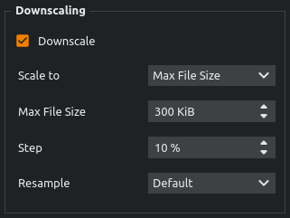
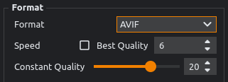
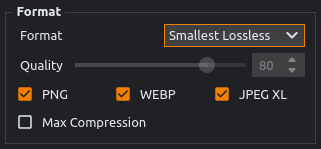

<p align="center">
    
</p>
<h3 align="center">XL Converter</h3>

Powerful image converter for the latest formats with support for multithreading, dynamic downscaling, drag 'n drop, and intelligent features.

Available for both Windows and Linux.


## Donations

I'm currently without a job, so I'd appreciate [your donation](https://codepoems.eu/donate).

The programming market is difficult to get into and my IT degree doesn't seem to be of any help. Donations will be used to pay for the hosting of my [website](https://codepoems.eu) where I post tutorials and software.


## Tutorials

### Linux Install

Run `./install.sh`

### How to Open AVIF and JPEG XL

- Windows - supported by [ImageGlass](https://imageglass.org/) / [XnViewMP](https://www.xnview.com/en/) / [PhotoQt](https://photoqt.org/) / [PicView](https://picview.org/) / [nomacs](https://nomacs.org/windows-10/) / [GIMP](https://www.gimp.org/)
- Linux
    - JPEG XL - [tutorial](https://codepoems.eu/posts/how-to-open-jpeg-xl-images-on-linux/)
    - AVIF - [tutorial](https://codepoems.eu/posts/how-to-open-avif-images-on-linux/)

## Supported Formats
### Images

Encoding is supported for all the latest formats.

|Format|Encoding|Decoding |Downscaling|
|-|:-:|:-:|:-:|
|JPEG XL|Yes|Yes|Yes|
|AVIF|Yes|Yes|Yes|
|WEBP|Yes|Yes|Yes|
|JPG|Yes|Yes|Yes|
|PNG|Yes|Yes|Yes|
|Smallest Lossless|Yes|Yes|-|
|HEIF|-|Yes|to PNG|
|TIFF|-|Yes|to PNG|
|JP2|-|Yes|to PNG|
|BMP|-|Yes|to PNG|
|ICO|-|Yes|to PNG|

### Animation

XL Converter is an image-only tool. Animation support is limited, will not be expanded, and may be removed in the future.

|Format|Encoding|Decoding|Encoding Input|Notes|
|-|:-:|:-:|:-:|-|
|JPEG XL|Yes|-|GIF, APNG|Limited to Effort 7|
|WEBP|Yes|-|GIF|-|
|GIF|-|Yes|-|-|


## Features
### General
#### Dynamic Downscaling

Shrink your images to fit under a **desired file size**. XL Converter can dynamically **adjust the resolution** for you. It works regardless of format and is compatible with intelligent effort.



More downscaling methods are also available: to percent, max resolution, shortest, and longest side.

#### JPEG XL and AVIF

Encode to both of these great formats. Each one has its strengths.



#### Lossless (If Smaller)

Converts to both lossy and lossless then picks the smallest file.

#### Smallest Lossless

Every image is checked with each of the 3 formats (Optimized PNG, WEBP, and JPEG XL) to deliver **the tiniest file size** without any loss of quality.



**Max Compression** option prolongs the conversion but grants encoders more time to shrink the images.

You can also use it to **optimize your PNGs**, so they'd take up less space. To do this leave only PNG checked.

### JPEG XL

#### Intelligent Effort

Gives you **smaller file sizes** and quite possibly **better quality**. The downside is **longer conversion time**. I wrote an [article](https://codepoems.eu/posts/jpeg-xl-effort-setting-explained) demystifying the effort argument.

#### JPG Reconstruction

Convert your JPGs to JPEG XL without losing any quality. Select JPEG XL, check lossless and you're good to go.

### Technical
#### Multithreading

Some encoders only work on a single thread. XL Converter spawns multiple instances of an encoder to utilize more threads. 

This makes encoding JPEG XL as many times faster as the amount of threads used.

#### Image Proxy

Encoders are picky, but XL Converter isn't. Feed it any format it can decode and the conversion will still be finished despite the encoder not supporting it.

For example: HEIF to JPEG XL

#### Burst Mode

For small amounts of images, the extra threads will be spread out for maximum performance.

Works best in AVIF. Other encoders don't seem to use extra threads much.

## Building

The build will be generated to `dist/xl-converter`.

### Windows

Install [Python3](https://www.python.org/downloads/).

Install dependencies

```
python install -r requirements.txt
```

Build

```
python build.py
```

### Linux

Install `Python3` and `pip`

```
sudo apt update
sudo apt install python3
sudo apt install pip
```

Install Qt dev tools.

```bash
sudo apt-get install '^libxcb.*-dev' libx11-xcb-dev libglu1-mesa-dev libxrender-dev libxi-dev libxkbcommon-dev libxkbcommon-x11-dev
```

Install dependencies
```bash
make setup
```

Build

```bash
make linux
```

## Running

Install dependencies from the [Building](#building) section and replace the last step.

- Windows - `python main.py`
- Linux - `make run`

## Contributions

Branches
- `unstable` - all changes are committed here first
- `stable` - current stable release