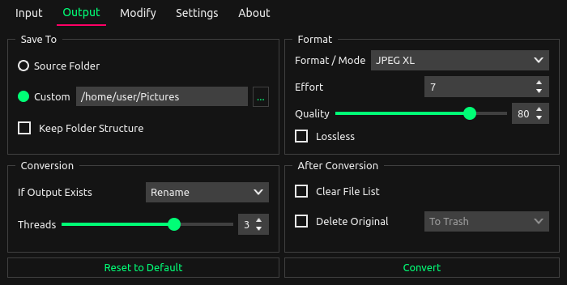

<div align="center">
    
<h3 align="center">XL Converter</h3>

Easy-to-use image converter for modern formats.

Available for Windows and Linux.



Read the [Manual](https://xl-docs.codepoems.eu)
</div>

## Features

#### JPEGLI

Generate fully compatible JPEG images with up to [35% better compression ratio](https://opensource.googleblog.com/2024/04/introducing-jpegli-new-jpeg-coding-library.html).

#### Format Support

Maximize image compression with **JPEG XL** and **AVIF**. Also available: **WebP**, **JPEG**, and **PNG**.

#### Parallel Encoding

Run encoders in parallel for increased throughput.

#### Lossless JPEG Transcoding

Reduce the file size of your JPEG images by 16% - 22% with Lossless JPEG Transcoding. This process is reversible.

#### Downscaling

Scale down images to resolution, percent, shortest (and longest) side, and megapixels.

## Download

[Official website](https://codepoems.eu/xl-converter)

## Building from Source

> [!NOTE]
> The recommended way of using XL Converter is through the [official binary releases](https://codepoems.eu/xl-converter). The building process is time-consuming.

### Windows 10

Prerequisites:
- [Python 3.13](https://python.org/downloads/) (check `Add python.exe to PATH`)
- [git](https://git-scm.com/)
- [MSYS2](https://msys2.org/)
- Visual Studio 2022 (with Windows 10 or 11 SDK)
- Latest [vc_redist](https://aka.ms/vs/17/release/vc_redist.x64.exe)

Launch MSYS2 MINGW64 and run:

```bash
pacman -Syu
```

If MSYS2 asks to restart, agree, and relaunch it.

Install packages:

```bash
pacman -S --needed \
    git \
    cmake \
    wget \
    make \
    base-devel \
    autoconf \
    automake \
    libtool \
    nasm \
    mingw-w64-x86_64-gcc \
    mingw-w64-x86_64-toolchain \
    mingw-w64-x86_64-cmake \
    mingw-w64-x86_64-ninja \
    mingw-w64-x86_64-gtest \
    mingw-w64-x86_64-giflib \
    mingw-w64-x86_64-libpng \
    mingw-w64-x86_64-libjpeg-turbo \
    mingw-w64-x86_64-rust \
    mingw-w64-x86_64-7zip \
    mingw-w64-x86_64-imagemagick \
    mingw-w64-x86_64-libjxl \
    mingw-w64-x86_64-aom
```

Relaunch MSYS2 MINGW64 again.

> [!IMPORTANT]
> If you installed or upgraded any package, restart the MSYS2 environment. Otherwise, building will start failing for random reasons.

Clone the repo:

```bash
git clone -b stable --depth 1 https://github.com/JacobDev1/xl-converter.git
cd xl-converter
```

Run each target individually; each has additional requirements:
- `make libjpeg-turbo`
- `make libavif`
- `make imagemagick`
- `make libjxl`
- `make oxipng`
- `make exiftool`

Launch CMD, enter the project's directory, and setup a virtual environment:

```cmd
cd C:\msys64\home\user\xl-converter
python -m venv env_build
env_build\Scripts\activate
pip install -r requirements.txt
```

Run the application:

```cmd
python main.py
```

#### Building

Launch CMD, and setup PyInstaller:

```cmd
cd C:\msys64\home\user\xl-converter
call misc\build_scripts\windows\pyinstaller.cmd
env_build\Scripts\activate
```

The last line reloads the environment to avoid the `ModuleNotFoundError`.

Bundle:

```cmd
python build.py
```

### Linux (Ubuntu-based)

Prerequisites:
- Docker (set up to run without root)
- [pyenv](https://github.com/pyenv/pyenv) ([add to shell](https://github.com/pyenv/pyenv?tab=readme-ov-file#set-up-your-shell-environment-for-pyenv))

Install packages:

```bash
sudo apt update
sudo apt install git make curl fuse p7zip-full
```

Install [xcb QPA](https://doc.qt.io/qt-6/linux-requirements.html) dependencies:

```bash
sudo apt install '^libxcb.*-dev' libfontconfig1-dev libfreetype6-dev libx11-dev libx11-xcb-dev libxext-dev libxfixes-dev libglu1-mesa-dev libxrender-dev libxi-dev libxkbcommon-dev libxkbcommon-x11-dev
```

Install Python build dependencies:

```bash
sudo apt install wget build-essential libreadline-dev libncursesw5-dev libssl-dev libsqlite3-dev tk-dev libgdbm-dev libc6-dev libbz2-dev libffi-dev zlib1g-dev liblzma-dev
```

Compile and setup Python `3.13`:

```bash
pyenv install 3.13
pyenv global 3.13
```

Clone and set up the repo:

```bash
git clone -b stable --depth 1 https://github.com/JacobDev1/xl-converter.git
cd xl-converter
```

Compile dependencies:

```bash
make deps
```

Setup a virtual environment:

```bash
python -m venv env_build
source env_build/bin/activate
pip install -r requirements.txt
```

Run the program:

```bash
python main.py
```

#### Building

Setup PyInstaller:

```bash
./misc/build_scripts/linux/pyinstaller.sh
source env_build/bin/activate
```

The last line reloads the environment to avoid the `ModuleNotFoundError`.

Build:

```bash
python build.py
```

## Testing

[Setup repo](#building-from-source).

Create a test environment.

```bash
python -m venv env_dev
source env_dev/bin/activate
pip install -r requirements.txt -r requirements_test.txt
```

### Unit Tests

```cmd
python test.py
```

You can control which tests to run. Run `python test.py --help` to learn more.

### Functional Tests

`test_convert.py` is a separate test suite focusing on validating program's output.

#### Linux

```bash
sudo apt install xvfb
make test-convert
```

#### Windows

```bash
python test_convert.py
```

## Contributing

Before contributing to issues or sending pull requests, please review [CONTRIBUTING.md](./.github/CONTRIBUTING.md).
